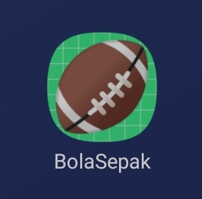
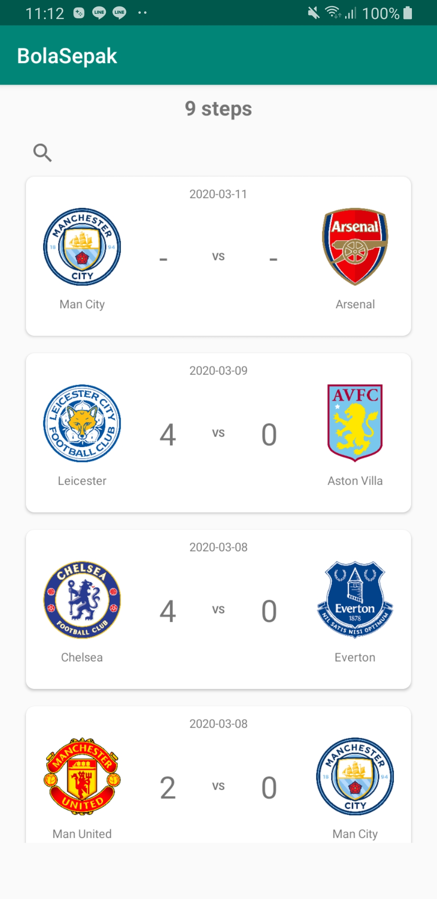
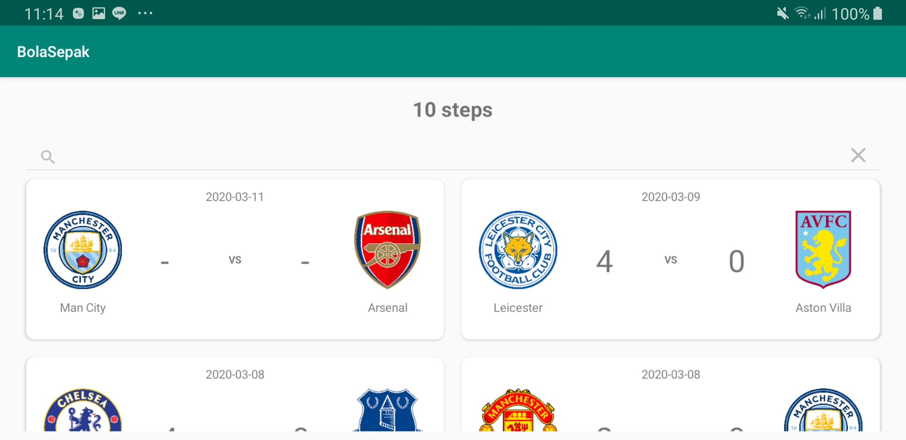
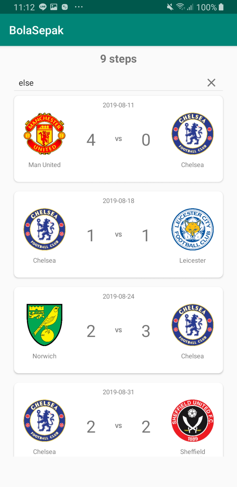
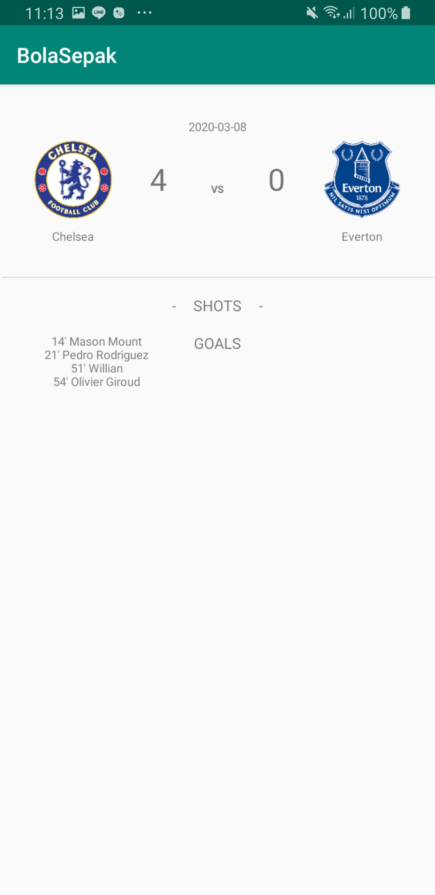
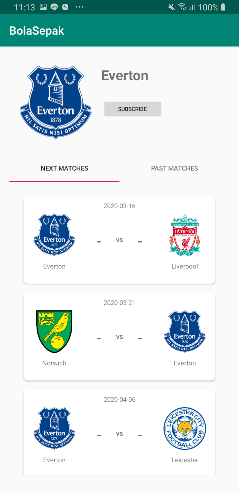
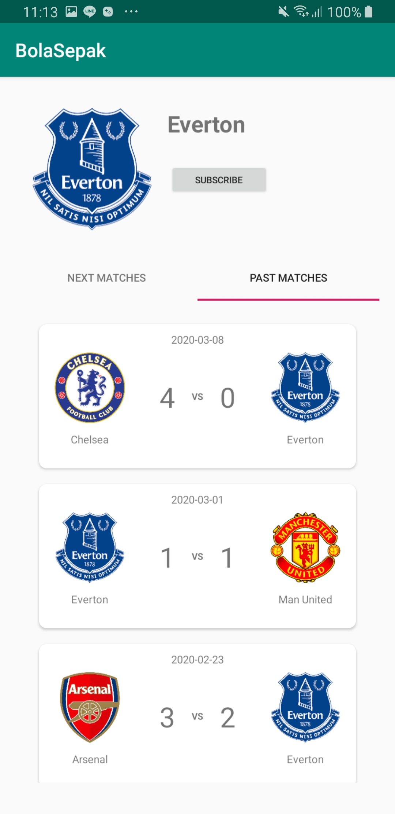
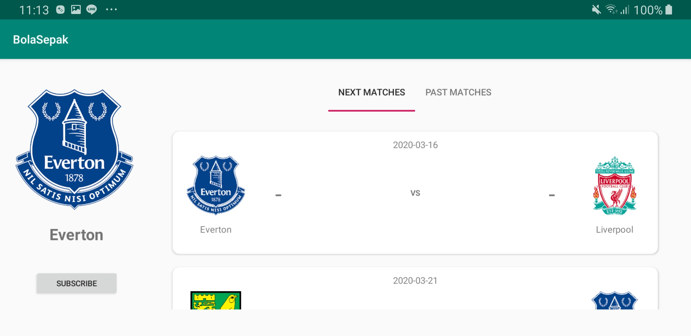
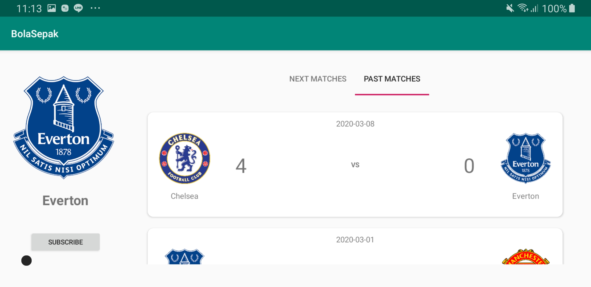

# Bola Sepak

Tugas Besar Platform Based Development - Bola Sepak

Disusun oleh:

- Lukas Kurnia Jonathan / 13517006
- Ainun F V / 13517057
- Sekar L M / 13517114

## Deskripsi Aplikasi
Aplikasi BolaSepak adalah aplikasi yang mampu memberikan **schedule** dari pertandingan yang sudah terlaksana maupun belum terlaksana. Pengguna dapat mencari dan melihat informasi terkait pertandingan seperti waktu pertandingan, cuaca, jumlah skor beserta pencetaknya. 

Pengguna juga dapat mensubscribe sebuah tim tertentu untuk mendapatkan notifikasi adanya pertandingan. Selain itu pengguna dapat melihat jumlah langkah yang sudah dilakukan setiap harinya.

## Cara Kerja
Ketika aplikasi dibuka maka akan ditampilan home yang berisi **sechedule** daftar pertandingan yang telah lewat sampai waktu yang terbaru. 

Pada tempat ini dapat dilakukan **pencarian** terhadap sebuah pertandingan oleh tim tertentu. Selain itu jumlah **step counter** akan ditampilkan ketika pengguna berjalan setiap harinya. Digunakan sensor dan service untuk menghitung step counter.

Ketika sebuah pertandingan ditekan maka akan dimunculkan event detail yang memperlihatkan waktu pertandingan, jumlah skor, dan pencetak gol dari skor tersebut.

Aplikasi dapat dilanjutkan dengan melihat pertandingan apa saja yang sudah dilakukan atau akan dilakukan oleh tim tertentu.

Seluruh kegiatan komunikasi antara halaman menggunakan hubungan activity, intent, dan fragment.

Ketika aplikasi tidak terkoneksi dengan internet, maka aplikasi akan menyimpan data cache terakhir ketika aplikasi tersambung internet. Penyimpanan data dilakukan pada database menggunakan SQLite.

Mekanisme notifikasi dilakukan dengan memberikan informasi atau *alert* ketika sebuah tim yang di subscribe akan melakukan pertandingan pada rentang waktu mendatang

## Library

Implementation **'com.android.volley:volley:1.1.1'**
dependency ini digunakan untuk melakukan koneksi ke API. Untuk mendapatkan data dari API, aplikasi akan menjalankan Request dan API akan memberikan Response dalam bentuk JSON. Request dan Response ini ditangani oleh Volley.

Implementation **'com.squareup.picasso:picasso:2.71828'**
dependency ini digunakan untuk meletakkan gambar yang didapatkan dari URL untuk di ImageView.

## Screenshot
- Logo BolaSepak 

- Home Screen Potrait

- Home Screen Landscape 

- Search

- Event Detail

- Next Potrait

- Past Potrait

- Next Landscape

- Past Landscape

